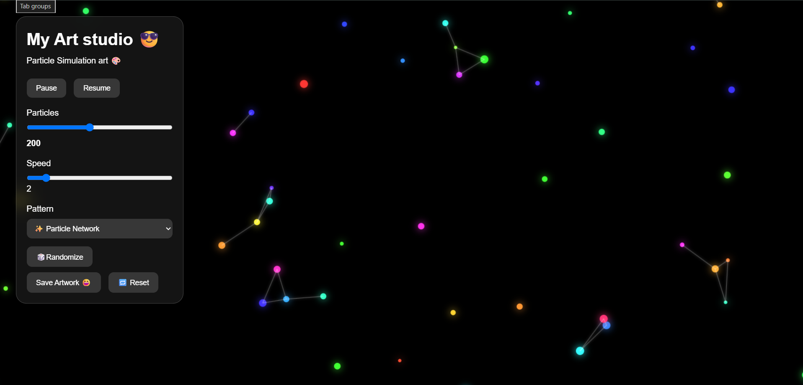

# 🎨 Generative Art Studio

A small interactive generative art project made with **HTML, CSS and JavaScript**.

The idea behind this project was to create a website that can generate different animated patterns using particles. I wanted to experiment with JavaScript Canvas and see how simple rules and a little randomness could create interesting visuals.

## ✨ What it can do

* Create animated particle patterns
* Connect nearby particles with glowing lines
* Change the number of particles
* Control the animation speed
* Pause and resume the animation
* Switch between different patterns
* Randomize the artwork
* Reset the settings
* Save the generated artwork as a PNG
* Interact with the animation using the mouse

## 🎨 Current Patterns

The project currently has a few different patterns:

* ✨ Particle Network
* 🌌 Galaxy
* 🌊 Waves
* 🌀 Spiral
* ✨ Fireflies

Each pattern uses slightly different movement rules, so the same particle system can create completely different results.

## 🛠️ Built With

* HTML
* CSS
* JavaScript
* HTML5 Canvas

No frameworks or libraries are used. Everything is built with basic web technologies.

## 📂 Project Structure

```text
generative-art/
│
├── index.html
├── style.css
├── script.js
└── README.md
```

## 🚀 How to Run

You don't need to install anything.

1. Download or clone this repository.
2. Open `index.html` in a browser.
3. Start experimenting with the controls.

You can also use VS Code with the Live Server extension if you want to run it locally while developing.

## 🎮 Controls

**Particles**
Controls how many particles are displayed.

**Speed**
Controls how quickly the particles move.

**Pattern**
Changes the type of animation.

**🎲 Randomize**
Creates a new arrangement and randomly chooses a pattern.

**💾 Save Artwork**
Saves the current canvas as a PNG image.

**🔄 Reset**
Returns the project to its default settings.

**⏸ Pause / ▶ Resume**
Stops and starts the animation.

## 📚 What I Learned

While making this project, I got more comfortable with:

* JavaScript functions
* Arrays and loops
* Objects
* Event listeners
* HTML Canvas
* Mouse interaction
* Random numbers
* Basic animation with `requestAnimationFrame()`
* Connecting JavaScript with HTML controls
* Using Git and GitHub

One of the main things I learned is that even simple particle movement can create very different results when the movement rules are changed.

## 🔮 Future Ideas

There are still a lot of things I want to experiment with:

* 🖱️ Mouse painting
* 💥 Particle explosions
* 🌀 Kaleidoscope patterns
* 🌈 More color effects
* 🎵 Music-reactive animations
* 🌌 Click-to-create galaxies
* 🕳️ Gravity effects


## 📸 Preview



Made while learning and experimenting with JavaScript. 🎨
